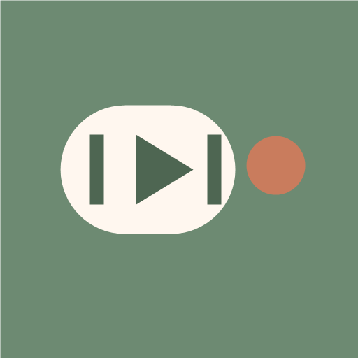
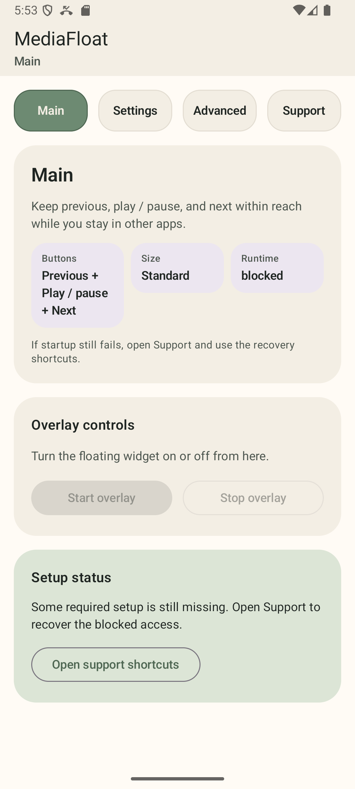
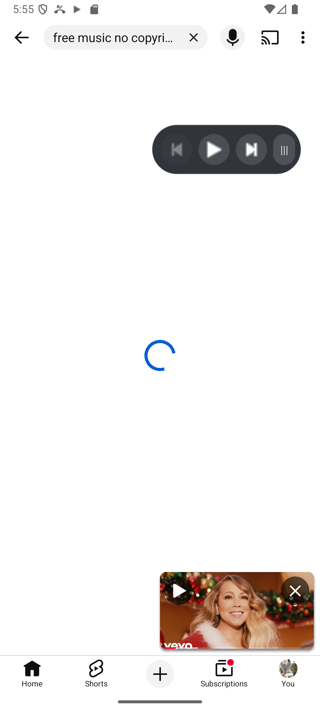

<p align="center">
  
</p>

<h1 align="center">MediaFloat</h1>

<p align="center">
  Floating media controls for Android.
</p>

<p align="center">
  A compact overlay bar that keeps previous, play/pause, and next within reach while you stay in other apps.
</p>

<p align="center">
  <strong>v0.3.3</strong> · <strong>Android 10+</strong> · <strong>Kotlin</strong> · <strong>Jetpack Compose</strong>
</p>

## Why MediaFloat

MediaFloat focuses on one job: giving Android media controls a small, movable surface that stays available above other apps. The app stays intentionally narrow so setup, runtime behavior, and recovery remain understandable.

## What ships in v0.3.3

- A floating overlay bar for `Previous`, `Play / pause`, and `Next`
- Saved overlay position, width presets, theme presets, and persistent runtime behavior
- Main, Settings, Advanced, Support, and hidden Debug surfaces inside the single-module app
- Widget controls for opacity, media artwork, media text, and left/right sidebar placement
- App-language support for `System default`, English, Korean, Chinese, Japanese, Spanish, and French
- Android resource-backed shell text for the shipped app surfaces and runtime-facing notices
- A foreground-service runtime with readiness checks for overlay, notification listener, and notification posture
- Launcher shortcuts for `Launch widget`, `Stop widget`, and `Toggle widget`
- Triple-tap stop on the floating widget drag handle
- An exported automation action for launching the overlay flow from routines or shortcuts

## Screenshots

<p align="center">
  
  
</p>

## Quick start

1. Clone the repository.
2. Open it in Android Studio.
3. Let Gradle sync.
4. Run the `app` configuration on an emulator or Android device.

Command line install:

```bash
./gradlew installDebug
```

Windows:

```bat
gradlew.bat installDebug
```

## First-run setup

MediaFloat depends on Android system capabilities before the overlay can remain active:

1. Open `MediaFloat`.
2. Grant overlay access, also known as display over other apps.
3. Grant notification-listener access so MediaFloat can observe active media sessions.
4. Allow app notifications, especially on Android 13+, so the foreground-service notification stays visible.
5. Start playback in a media app.
6. Use `Main`, `Settings`, or `Debug` to start the overlay.

If readiness is blocked, the app exposes shortcuts back to the relevant system settings screens.

## Permissions

| Permission or access | Why MediaFloat needs it |
| --- | --- |
| `SYSTEM_ALERT_WINDOW` | Shows the floating control bar above other apps |
| `FOREGROUND_SERVICE` and `FOREGROUND_SERVICE_SPECIAL_USE` | Keeps the overlay runtime visible and recoverable |
| `POST_NOTIFICATIONS` | Shows the required foreground-service notification |
| Notification listener access | Reads active media-session state and supported transport actions |

## App surfaces

- `Main` - start or stop the overlay quickly and see whether setup is ready
- `Settings` - adjust visible buttons, size presets, width, opacity, and core widget behavior
- `Advanced` - choose app language, theme preset, sidebar side, persistent overlay mode, and Debug visibility
- `Support` - review setup guidance, runtime/media status, version details, product constraints, and license notices
- `Debug` - inspect runtime readiness, inspect media readiness, send transport commands, start or stop the overlay, clear logs, and review recent events

## App language support

MediaFloat `v0.3.3` uses the AppCompat app-language path so locale selection works on Android 13+ and older supported versions.

Available app languages:

- `System default`
- `English`
- `Korean`
- `Chinese`
- `Japanese`
- `Spanish`
- `French`

The language picker lives in `Advanced`, and the current app language is reflected in `Support`.

## Automation hook

MediaFloat includes an exported action for launching the overlay flow from automation tools:

```text
sw2.io.mediafloat.action.SHOW_OVERLAY
```

The launcher shortcut set exposes `Launch widget`, `Stop widget`, and `Toggle widget` for quick control without opening the full app UI.

If readiness is blocked, the app falls back to the main interface so the missing access can be fixed.

## Release signing

This repository includes `keystore.properties.example` as the expected release-signing shape.

To wire a signed local release build:

1. Copy `keystore.properties.example` to `keystore.properties`.
2. Generate or place your release keystore at the configured path.
3. Update the store password, key alias, and key password values.
4. Run `gradlew.bat assembleRelease` on Windows or `./gradlew assembleRelease` elsewhere.

`keystore.properties` and local keystore files are ignored by Git.

## License

MediaFloat is distributed under the [Apache License 2.0](LICENSE).

The app also includes a concise in-app notice summary for the main third-party libraries used in the shipped Android build, including AndroidX, Compose Material 3, Google Material Components, and Kotlin standard library components.
